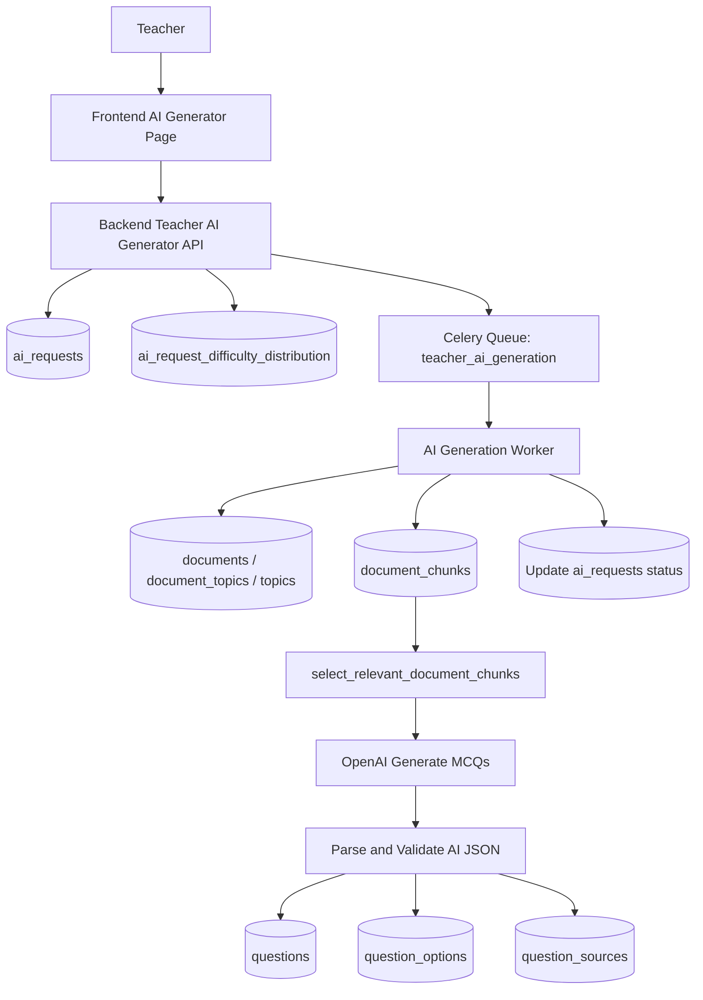
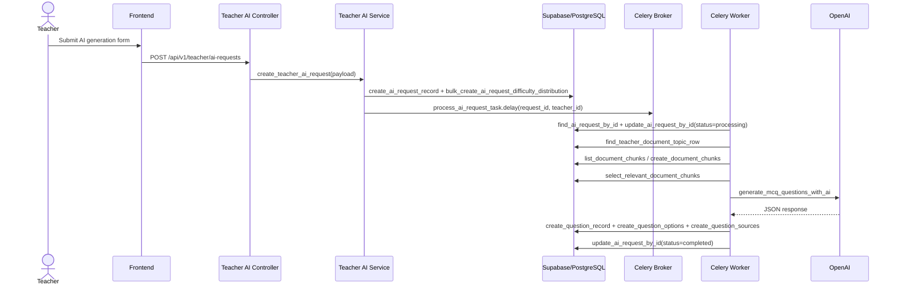
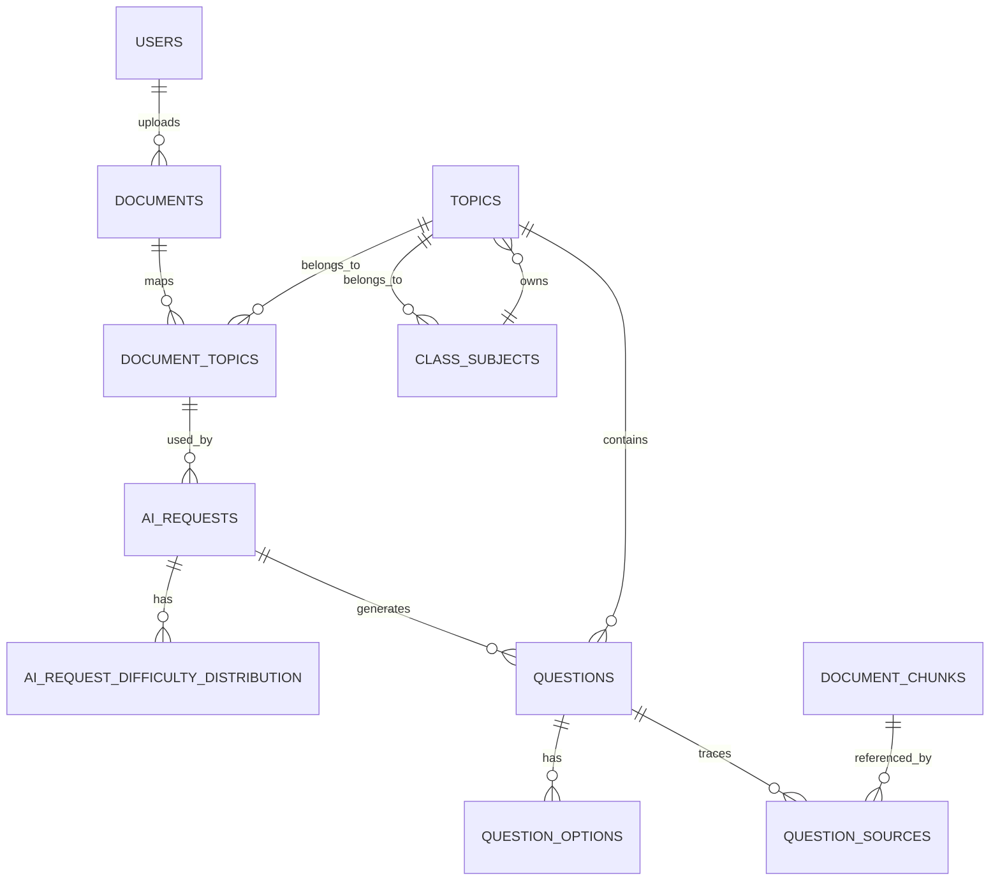

# AI Question Generation Pipeline

## 1. Tổng quan chức năng

Chức năng AI tạo câu hỏi trắc nghiệm tự động trong Quizi-fy cho phép giáo viên sinh ra câu hỏi ôn tập từ tài liệu học tập đã upload.

- Actor chính: giáo viên.
- Input chính:
  - `document_topic_id` (chọn tài liệu và chủ đề liên kết với tài liệu đó)
  - `num_questions` (số lượng câu hỏi mong muốn)
  - `difficulty_distribution` (phân bổ số lượng theo độ khó)
  - `content_scope` (phạm vi nội dung, ví dụ chương, trang, toàn bộ tài liệu)
- Output chính:
  - câu hỏi trắc nghiệm multiple-choice
  - 4 phương án đáp án
  - đáp án đúng
  - giải thích
  - độ khó
  - trạng thái câu hỏi
  - nguồn câu hỏi: `ai`
- Kết quả được lưu vào cơ sở dữ liệu Supabase/PostgreSQL, không chỉ trả về tạm thời.

Giáo viên upload tài liệu, sau đó chọn tài liệu/chủ đề và gửi yêu cầu AI. Hệ thống tạo bản ghi `ai_requests`, đẩy job vào Celery queue và worker xử lý nền để sinh câu hỏi.

## 2. Công nghệ sử dụng

| Nhóm                  | Công nghệ / thư viện         | File sử dụng                                                                                             | Vai trò trong pipeline                               | Ghi chú                                                         |
| --------------------- | ---------------------------- | -------------------------------------------------------------------------------------------------------- | ---------------------------------------------------- | --------------------------------------------------------------- |
| Web framework         | FastAPI                      | `backend/controllers/teacher_ai_generator_controller.py`, `backend/controllers/ai_request_controller.py` | Định nghĩa endpoint API cho teacher và admin         | Dùng `APIRouter` và `Depends(require_roles(...))`               |
| Background job        | Celery                       | `backend/workers/celery_app.py`, `backend/workers/ai_generation_worker.py`                               | Định nghĩa task, queue, worker xử lý nền             | Queue tên `teacher_ai_generation`                               |
| Queue broker          | Redis                        | `backend/core/config.py`                                                                                 | Broker và result backend cho Celery                  | Giá trị lấy từ env `CELERY_BROKER_URL`, `CELERY_RESULT_BACKEND` |
| Database              | Supabase / PostgreSQL        | `backend/core/supabase.py`, repository                                                                   | Lưu ai_requests, questions, options, chunks, sources | Dùng Supabase client qua PostgREST API                          |
| Schema                | Pydantic                     | `backend/schemas/teacher_ai_generator_schema.py`, `backend/schemas/difficulty_schema.py`                 | Validate payload và AI response                      | Dùng model validate cho AI JSON                                 |
| LLM provider          | OpenAI Python SDK            | `backend/utils/openai_util.py`, `backend/services/embedding_service.py`                                  | Gọi Chat Completions và Embeddings                   | API key từ env `OPENAI_API_KEY`                                 |
| Text extraction       | `pypdf`, `python-docx`       | `backend/utils/document_extract_util.py`                                                                 | Trích nội dung PDF/DOCX/TXT từ URL                   | Dùng `httpx` để fetch file bytes                                |
| Chunking              | Custom utility               | `backend/utils/document_chunking_util.py`                                                                | Xây chunk văn bản, phân đoạn, overlap                | max chunk 8000 chars, overlap 500 chars                         |
| Embedding / retrieval | pgvector + OpenAI embeddings | `backend/services/document_chunk_service.py`, migrations                                                 | Chọn chunk theo semantic search                      | Fallback keyword nếu embedding thất bại                         |
| Storage               | Supabase Storage             | `backend/utils/storage_util.py`                                                                          | Lưu document và image uploads                        | `SUPABASE_DOCUMENT_BUCKET` và `SUPABASE_IMAGE_BUCKET`           |
| Logging               | Python logging               | `backend/services/teacher_ai_generator_service.py`                                                       | Ghi log job chi tiết                                 | Dùng `_emit_ai_job_log`                                         |
| Database schema       | SQL / migration              | `backend/database-sql.sql`, `backend/migrations/*.sql`                                                   | Định nghĩa bảng liên quan                            | Includes `ai_requests`, `document_chunks`, `question_sources`   |

## 3. Luồng xử lý tổng thể

1. Frontend gửi request tạo câu hỏi tới endpoint `POST /api/v1/teacher/ai-requests`.
2. Backend validate quyền giáo viên bằng `require_roles("teacher")` và kiểm tra teacher có quyền với `document_topic_id`.
3. Backend tạo bản ghi `ai_requests` ở trạng thái `pending`.
4. Backend tạo bản ghi phân bổ độ khó trong `ai_request_difficulty_distribution`.
5. Backend đẩy job Celery `workers.ai_generation_worker.process_ai_request_task` vào queue `teacher_ai_generation`.
6. Celery worker nhận job và gọi `process_ai_request_job`.
7. Worker cập nhật `ai_requests.status` thành `processing`.
8. Worker tải thông tin document/topic bằng `find_teacher_document_topic_row`.
9. Worker kiểm tra quyền dữ liệu: `document_topics -> documents.teacher_id` và `topics.class_subjects.assigned_teacher_id`.
10. Worker extract tài liệu hoặc lấy chunks đã có: `_ensure_document_chunks_for_generation`.
11. Worker chọn chunk/context phù hợp bằng `select_relevant_document_chunks`.
12. Worker gọi AI qua `generate_mcq_questions_with_ai`.
13. Worker parse và validate kết quả AI bằng Pydantic `AiGeneratedQuestionsResponsePayload`.
14. Worker chống trùng câu hỏi bằng normalize nội dung và so sánh với existing questions.
15. Worker insert câu hỏi vào `questions` với `source='ai'`, `status='inactive'`.
16. Worker insert đáp án vào `question_options`.
17. Worker insert nguồn tham chiếu chunk vào `question_sources`.
18. Worker cập nhật `generated_question_count` sau khi hoàn thành.
19. Worker chuyển request sang `completed` nếu thành công hoặc `failed` nếu có lỗi.

> Lưu ý: code hiện tại tạo question status `inactive`, không phải `draft`.

## 4. Sơ đồ pipeline bằng Mermaid

### 4.1. Flowchart tổng thể

### 4.2. Sequence diagram

### 4.3. ERD rút gọn cho AI generation

## 5. Phân tích file `backend/workers/ai_generation_worker.py`

File này chỉ định nghĩa một Celery task duy nhất và gọi service async.

| Function / biến        | Vai trò             | Input                      | Output               | Side effects                                         | Ghi chú                                                          |
| ---------------------- | ------------------- | -------------------------- | -------------------- | ---------------------------------------------------- | ---------------------------------------------------------------- |
| `celery_app.task(...)` | Đăng ký Celery task | `request_id`, `teacher_id` | Không trả về giá trị | Thực thi `process_ai_request_job` bằng `asyncio.run` | Task name `workers.ai_generation_worker.process_ai_request_task` |

| `name=
